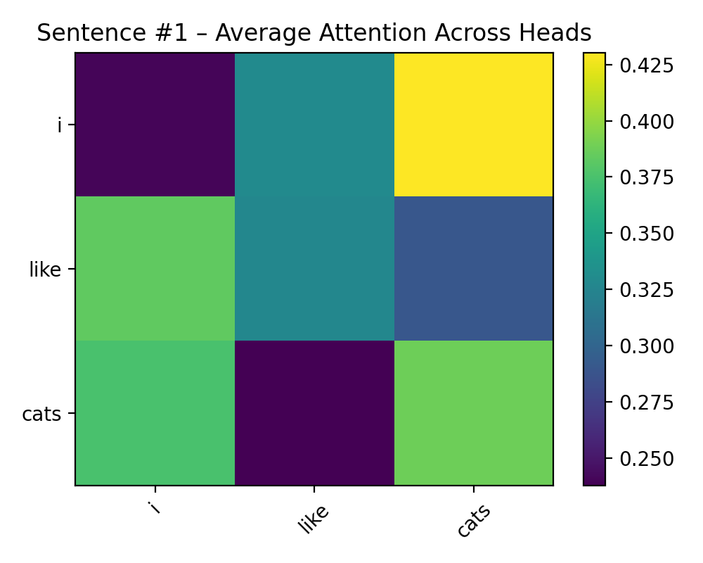

# Part 2 – Q2: Mini Transformer Encoder

### 👨‍🎓 Student Information
**Name:** Mohan Vamsi Pusaala  
**Student ID:** 700773458  
**Course:** CS5760 – Natural Language Processing  
**University:** University of Central Missouri  
**Semester:** Fall 2025  

---

## 🧠 Objective
Implement a **Mini Transformer Encoder** (no decoder) from scratch using PyTorch to process a batch of sentences and visualize attention between words.

---

## 📂 Files Included
| File | Description |
|------|--------------|
| `mini_transformer_encoder.py` | Fully-commented Python implementation |
| `requirements.txt` | Lists libraries needed |
| `results/attention_heatmap.png` | Attention heatmap for Sentence 1 |
| `results/console_output.txt` | Console summary (vocab size, shapes, sample embeddings) |
| `results/tokens.txt` | Input sentences after tokenization |
| `results/embeddings_sentence1.txt` | Full contextual embeddings for Sentence 1 |

---

## 🧩 Model Configuration
| Parameter | Value |
|------------|-------|
| Embedding dimension (`d_model`) | 64 |
| Feed-forward size (`d_ff`) | 128 |
| Number of attention heads | 2 |
| Sentences | 10 |
| Vocabulary size | 24 |
| Maximum sequence length | 3 |

---

## 📊 Sample Results
Vocab size: 24
Max seq len: 3
Final contextual embeddings shape: torch.Size([10, 3, 64])

Sample – Sentence 1 token embeddings (first 3 dims each):
token='i' → [-2.4492, -0.5322, -1.7721]
token='like' → [-0.3497, -0.8485, -0.1488]
token='cats' → [-0.9927, -0.2572, 1.5559]

---

## 🎨 Attention Heatmap
Average attention across heads for Sentence 1:



---

## ⚙️ How to Run
```bash
# create environment (optional)
python -m venv venv
source venv/bin/activate      # Linux/Mac
venv\Scripts\activate         # Windows

# install dependencies
pip install -r requirements.txt

# run script
python mini_transformer_encoder.py
